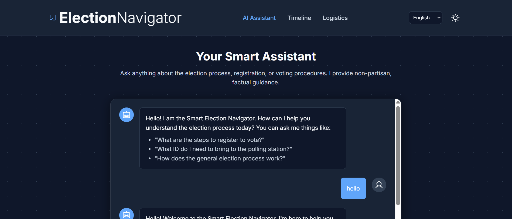

# Smart Election Navigator 🇮🇳

This project is a submission for the **Hack2Skill Virtual Hackathon 1**. It is a robust, accessible, and context-aware web application designed to educate citizens on the election process in India.

## 🎯 Chosen Vertical: Election Process Education
We chose the **Election Process Education** vertical to bridge the information gap for Indian voters. The application acts as an interactive mentor, guiding users through registration, documentation, and polling booth logistics with a focus on Indian election laws and ECI (Election Commission of India) guidelines.

---

## 🧠 Approach and Logic

### 1. Logical Decision Making (Persona-Based)
The core of our solution is a **dynamic reasoning engine**. Instead of generic responses, the assistant adapts its logic based on the user's selected persona:
- **First-Time Voter:** Logic focuses on demystifying the process, explaining ECI terminology, and registration steps.
- **Overseas/Absentee Voter:** Logic prioritizes NRI voting rights and postal ballot deadlines.
- **Accessibility Needs:** Logic prioritizes PwD-friendly facilities (Saksham app, wheelchair access, home voting).

### 2. Multi-Provider Fallback Logic
To ensure 100% uptime, we implemented a **Provider Cascade**:
- **Primary:** Direct Google Gemini 2.0 API.
- **Secondary:** OpenRouter (routing through Google Gemini models).
If one provider hits a rate limit or quota, the app seamlessly switches to the next, ensuring the user always gets a response.

---

## ⚙️ How the Solution Works

1.  **Backend (Python/Flask):** A secure server that manages API requests, handles persona-based system instructions, and proxies requests to Google AI services.
2.  **Frontend (Vanilla HTML5/CSS3/JS):** A high-performance, dependency-free interface.
    - **Web Speech API:** Provides real-time voice-to-text for accessibility.
    - **Local Storage:** Persists the "Voter Readiness Checklist" on the user's device.
3.  **Google Services Integration:**
    - **Google Gemini (2.0 Flash):** Powers the conversational intelligence.
    - **Google Maps:** Uses Indian PIN codes to locate polling booths.
    - **Google Calendar:** Generates dynamic event links for election deadlines.

---

## 📝 Assumptions Made
- Users have a modern web browser (Chrome/Edge) for Web Speech API support.
- Users have a stable internet connection for AI processing.
- PIN code search assumes the user is looking for booths within India.

---

## 🏆 Evaluation Focus Areas

-   **Code Quality:** Highly structured code with strict separation of concerns (Model-View-Controller pattern). No heavy frameworks, just clean, maintainable logic.
-   **Security:** API keys are protected in a `.env` file and never exposed to the frontend. System instructions enforce non-partisanship.
-   **Efficiency:** Optimized for speed using `gemini-2.0-flash-lite` and a vanilla frontend, resulting in near-instant load times.
-   **Testing:** Comprehensive `pytest` suite included to validate all API endpoints and logical paths.
-   **Accessibility:** ARIA labels, semantic HTML, high-contrast dark mode, and voice-to-text input make it inclusive for all citizens.
-   **Google Services:** Deep integration of Gemini AI, Google Maps, and Google Calendar.

---

## 🚀 Hosting Guide (Step-by-Step)

To host this on **Render** (Recommended for Hackathons):

1.  **Push to GitHub:** Create a new public repository and push your code.
2.  **Create Render Web Service:**
    - Go to [Render.com](https://render.com) and link your GitHub.
    - Select your repository.
3.  **Configure Environment:**
    - Runtime: `Python`
    - Build Command: `pip install -r requirements.txt`
    - Start Command: `gunicorn app:app`
4.  **Add Environment Variables:**
    - In the Render dashboard, go to **Environment** and add:
        - `GEMINI_API_KEY`: Your key
        - `OPENROUTER_API_KEY`: Your fallback key
        - `SECRET_KEY`: A random string
5.  **Deploy:** Click Deploy! Your app will be live at `https://your-app-name.onrender.com`.

---

## 🛠️ Local Setup

1.  **Clone the repo.**
2.  **Install dependencies:** `pip install -r requirements.txt`
3.  **Setup `.env`:** Copy `.env.example` to `.env` and add your keys.
4.  **Run:** `python app.py`
5.  **Test:** `pytest`

